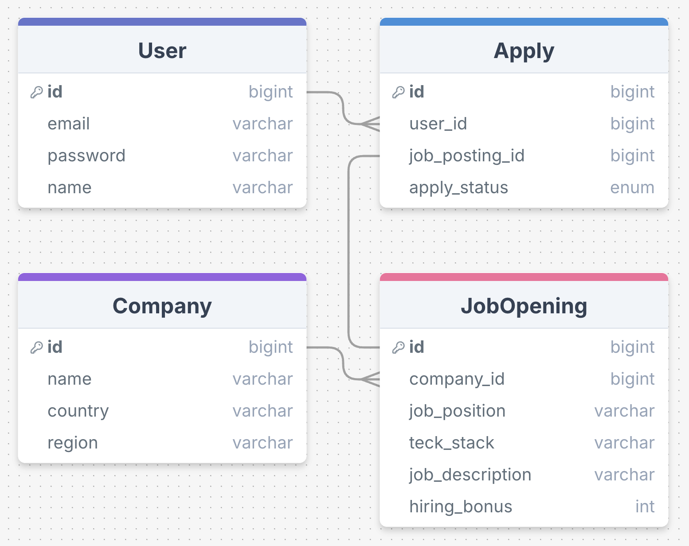

# 원티드 프리온보딩 사전과제

## ERD


## API 명세서

### 1. 채용 공고에 지원하기

- **URL**: `/api/apply`
- **Method**: `POST`
- **설명**: 사용자가 채용 공고에 지원합니다.
- **요청 본문**: `CreateApplyRequest` 객체
  ```json
    {
        "jobOpeningId": 1,
        "userId": 123
    }
- **요청 필드**:
    - `jobOpeningId (Long)`: 지원할 채용 공고의 ID
    - `userId (Long)`: 지원자의 ID
- **응답**: `ApiResponse` 객체
  ```json
    {
        "status": "success",
        "code": "200",
        "message": "요청이 성공적으로 처리되었습니다.",
        "data": null
    }

### 2. 채용 공고 등록하기

- **URL**: `/api/job-opening`
- **Method**: `POST`
- **설명**: 채용 공고를 등록합니다.
- **요청 본문**: `CreateJobOpeningRequest` 객체
  ```json
    {
        "companyId": 1,
        "jobPosition": "Front-end 개발자",
        "signingBonus": 1000000,
        "jobDescription": "클라우드 웹 서비스의 개발, 운영",
        "techStack": "JavaScript, React"
    }
- **요청 필드**:
    - `companyId (Long)`: 채용 공고를 등록할 회사의 ID
    - `jobPosition (String)`: 채용 포지션
    - `signingBonus (int)`: 채용 보상금
    - `jobDescription (String)`: 채용 내용
    - `techStack (String)`: 사용 기술
- **응답**: `ApiResponse` 객체
  ```json
    {
        "status": "success",
        "code": "200",
        "message": "요청이 성공적으로 처리되었습니다.",
        "data": null
    }

### 3. 채용 공고 수정하기

- **URL**: `/api/job-opening/{jobOpeningId}/company/{companyId}`
- **Method**: `PUT`
- **설명**: 채용 공고를 수정합니다.
- **경로 변수**:
    - `jobOpeningId (Long)`: 수정할 채용 공고의 ID
    - `companyId (Long)`: 수정할 채용 공고의 회사 ID
- **요청 본문**: `UpdateJobOpeningRequest` 객체
  ```json
    {
        "jobPosition": "프론트엔드 개발자",
        "signingBonus": 1000000,
        "jobDescription": "클라우드 웹 서비스의 개발 및 운영",
        "techStack": "JavaScript, React"
    }
- **요청 필드**:
    - `jobPosition (String)`: 수정할 채용 포지션
    - `signingBonus (int)`: 수정할 채용 보상금
    - `jobDescription (String)`: 수정할 채용 내용
    - `techStack (String)`: 수정할 사용 기술
- **응답**: `ApiResponse` 객체
  ```json
    {
        "status": "success",
        "code": "200",
        "message": "요청이 성공적으로 처리되었습니다.",
        "data": null
    }

### 4. 채용 공고 삭제하기

- **URL**: `/api/job-opening/{jobOpeningId}/company/{companyId}`
- **Method**: `DELETE`
- **설명**: 채용 공고를 삭제합니다.
- **경로 변수**:
    - `jobOpeningId (Long)`: 수정할 채용 공고의 ID
    - `companyId (Long)`: 수정할 채용 공고의 회사 ID
- **응답**: `ApiResponse` 객체
  ```json
    {
        "status": "success",
        "code": "200",
        "message": "요청이 성공적으로 처리되었습니다.",
        "data": null
    }

### 5. 채용 목록 조회하기

- **URL**: `/api/job-opening`
- **Method**: `GET`
- **설명**: 채용 공고 목록을 조회합니다.
- **응답**: `ApiResponse` 객체
  ```json
    {
        "status": "SUCCESS",
        "code": "200",
        "message": "요청이 성공적으로 처리되었습니다.",
        "data": [
          {
            "jobOpeningId": 1,
            "companyName": "원티드랩",
            "country": "한국",
            "region": "서울 송파구",
            "jobPosition": "백엔드 개발자",
            "signingBonus": 500000,
            "techStack": "django python"
          },
          {
            "jobOpeningId": 2,
            "companyName": "롯데카드",
            "country": "한국",
            "region": "서울 종로구",
            "jobPosition": "안드로이드 개발자",
            "signingBonus": 1000000,
            "techStack": "Kotlin, Coroutine, KTX, Databinding"
          },
       ]
    }
- **응답 필드**:
    - `jobOpeningId (Long)`: 채용 공고를 등록한 회사의 ID
    - `companyName (String)`: 채용 공고를 등록한 회사의 이름
    - `country (String)`: 회사 국가
    - `region (String)`: 회사 지역
    - `jobPosition (String)`: 채용 포지션
    - `signingBonus (int)`: 채용 보상금
    - `techStack (String)`: 사용 기술

### 6. 채용 공고 상세 조회

- **URL**: `/api/job-opening/{jobOpeningId}`
- **Method**: `GET`
- **설명**: 채용 공고를 상세 조회합니다.
- **경로 변수**:
    - `jobOpeningId (Long)`: 조회할 채용 공고의 ID
- **응답**: `ApiResponse` 객체
  ```json
  {
        "status": "SUCCESS",
        "code": "200",
        "message": "요청이 성공적으로 처리되었습니다.",
        "data": {
            "jobOpeningId": 1,
            "companyName": "원티드랩",
            "country": "한국",
            "region": "서울 송파구",
            "jobPosition": "백엔드 개발자",
            "signingBonus": 500000,
            "techStack": "django python"
        }
  }

- **응답 필드**:
    - `jobOpeningId (Long)`: 채용 공고를 등록한 회사의 ID
    - `companyName (String)`: 채용 공고를 등록한 회사의 이름
    - `country (String)`: 회사 국가
    - `region (String)`: 회사 지역
    - `jobPosition (String)`: 채용 포지션
    - `signingBonus (int)`: 채용 보상금
    - `techStack (String)`: 사용 기술
    - `jobDescription (String)`: 채용 내용
    - `otherJobOpeningIdsByCompany (List<Long>)`: 회사의 다른 채용 공고 ID